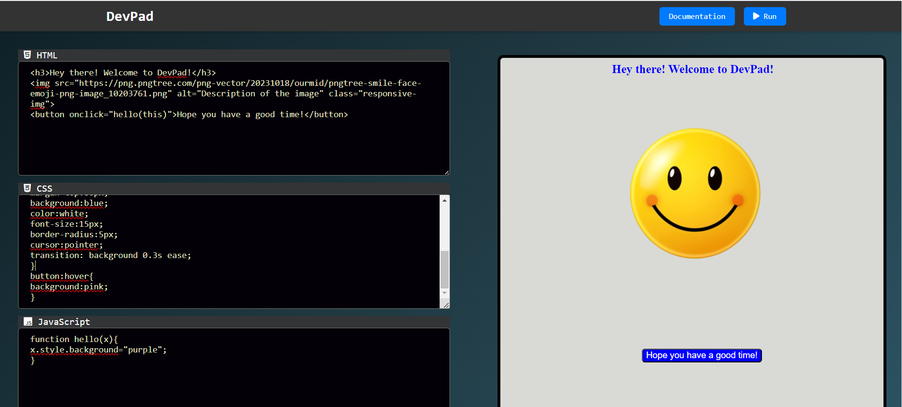
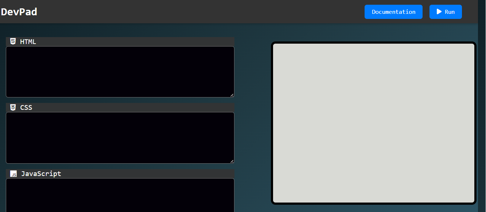

# DevPad

**DevPad** is a web-based code editor that allows users to practice HTML, CSS, and JavaScript in real-time. It provides an integrated development environment where you can write, run, and see the output of your code instantly.

## Features

- **Integrated Code Editor**: Write HTML, CSS, and JavaScript code in a single interface.
- **Live Preview**: View the output of your code in real-time.
- **Easy-to-Use Interface**: Simple and intuitive design for a seamless coding experience.
- **Documentation Access**: Quick access to MDN documentation for reference and learning.

## Demo




## How to Use

1. **Write Code**: Write your HTML, CSS, and JavaScript code in the respective text areas.
2. **Run Code**: Click the `Run` button to see the output of your code in the preview pane.
3. **Access Documentation**: Click the `Documentation` button to open the MDN documentation for reference.

## Installation

To run DevPad locally, follow these steps:

1. Clone the repository:
    ```bash
    git clone https://github.com/Nandini-Pandey
/devpad.git
    ```
2. Navigate to the project directory:
    ```bash
    cd devpad
    ```
3. Open `index.html` in your browser to start using DevPad.

## Responsive Design

